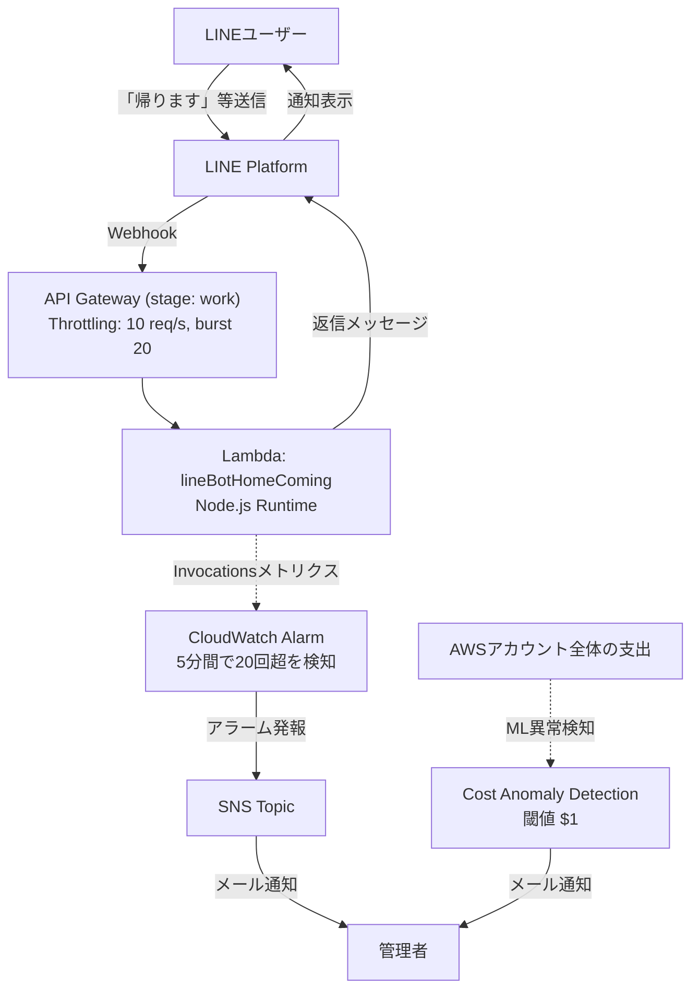

## 概要
LineBotのコードです。

## 仕様
1. ユーザーの「帰ります」というメッセージ送信がトリガー
2. 「お弁当が必要ですか？」というYes/Noの質問表示
  3. Yes→「お弁当が要ります！」表示
  4. No→「お弁当は不要です」表示

## ローカル実行
※ ngrokをIP固定して使います。
```bash
# それぞれを同時に実行する
ngrok http --url=<domain> <port>

npm run start
```

## 背景
父が仕事からの帰宅時に、帰宅の旨と次の日のお弁当の有無を連絡してくるため、その連絡を自動化してみようと思った。

## インフラ構成



想定外の大量呼び出しやコスト異常を検知するため、API Gatewayのスロットリングに加え、CloudWatch AlarmとCost Anomaly Detectionによる監視・メール通知を設定しています。

## 実行内容
・月〜木パターン


・金曜パターン


